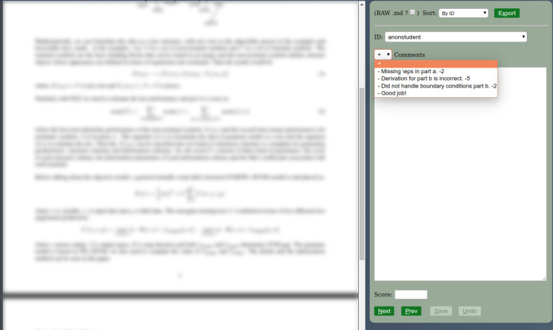

# fleval

Simple light-weight flask app for grading homeworks, scoring applications, reviewing papers, etc. A web-server runs locally and starts a browser to allow you to step through documents, showing you a two-pane view with the document on the left and a comment+score box on the right, with easy insertion of lines from comments in other documents (useful for commenting on common mistakes when grading homeworks). 



## Install


Requires python3 and the flask and markdown packages installed. Easiest way to install is using pip:

```
$ pip3 install fleval
```
This will install fleval with the required dependencies. 

Alternatively, just clone this repo, and add it to your path, and manually installing the dependencies (`pip3 install flask markdown`). This is a better option if you want to customize the scripts for your own requirements.

## Usage

```
usage: fleval [-h] [-ext EXT] [-nb] jsfile

positional arguments:
  jsfile      Name of JSON file that comments and scores will be saved in.

optional arguments:
  -h, --help  show this help message and exit
  -ext EXT    Extension of files to search for as submissions (e.g., html).
              Default pdf.
  -nb         Do not start browser, or close app when browser window closed.
```

Note that EXT can be anything your browser can display (pdf, html, txt). Run this in a directory, and `fleval` will help you step through `*.EXT`. The basenames of the files will be used as IDs. For example, to grade homework submissions, place all submissions in the same directory as `student.id1.pdf`, `student.id2.pdf`, etc.


### flerge

`flerge` is a script to help aggregate scores for different questions from different graders. 

```
USAGE: flagg.py out_dir [title]:file.js[,file2.js,...] [title2:file3.js,file4.js ...]
```

Say you have multiple questions (q1, q2, q3) and  TAs (ta1,ta2,ta3), and you ask them to save their scores for different questions for different subsets of students in `q?.ta?.js`. Moreover, you yourself store general comments (possibly with scores) in `general.js` and `latenote.js`. Then, you can run `flerge` as

```
$ flerge out/ :general.js,latenote.js 'Question 1':q1.*.js 'Question 2':q2.*.js 'Question 3':q3.*.js > out.csv
```

This will create a `id.html` for each student / submission in the directory `out/` collating scores from all the different json files, as well as print out a csv file with scores (per question, and total) for every submission.
